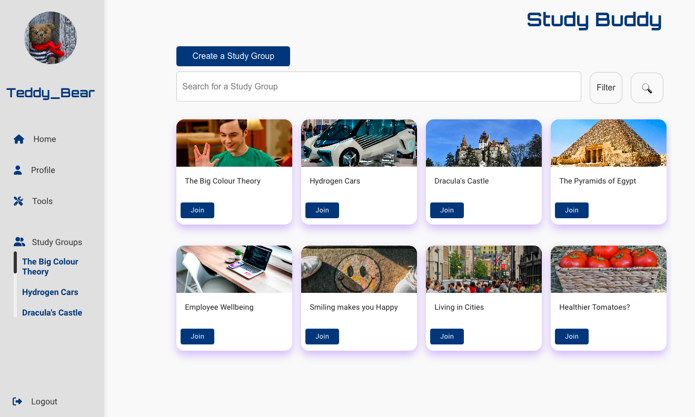
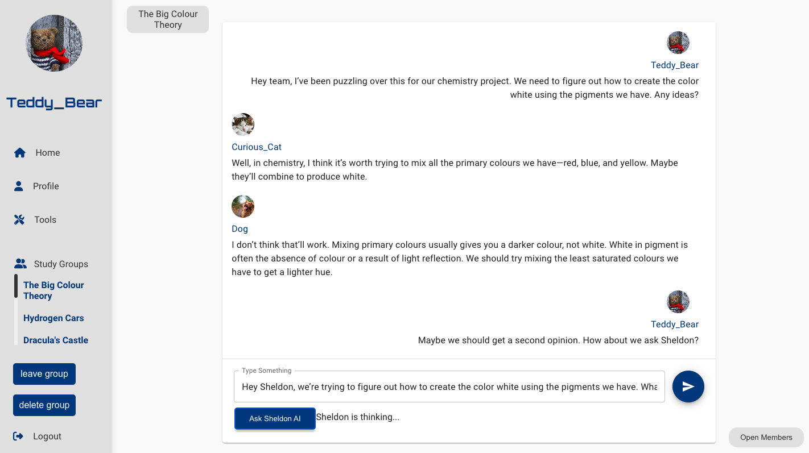
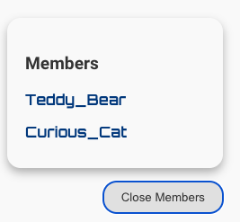
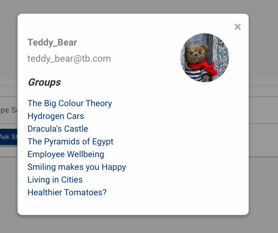
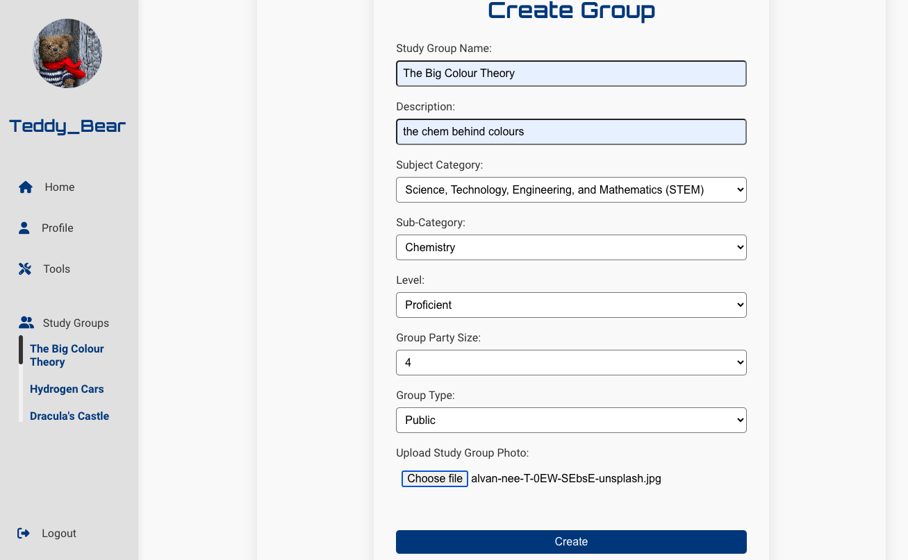
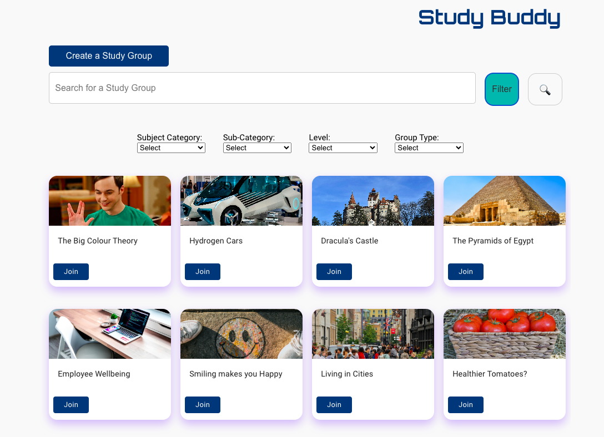
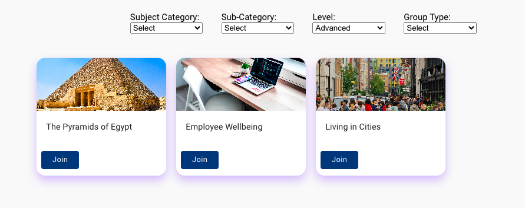
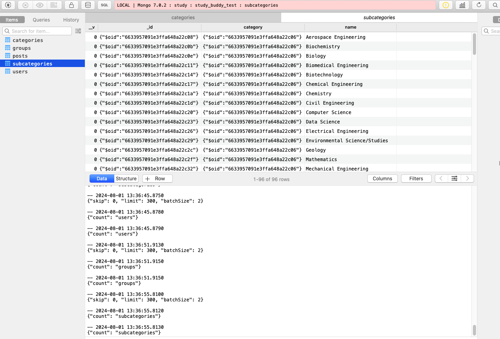

# Studt Buddy

## Table of Contents

[Description](#description) | [Features](#features) | [Result](#result) | [Thechnologies](#technologies) | [Installation](#instalation) | [Usage](#usage) | [Disclaimer](#discalimer)

## Description

Final group project for Makers Academy, where a virtual study group web app was developed. This app allows users to sign up, log in, update their profiles, and create interest-based study groups. Within these groups, users can communicate and collaborate, enjoying interactive learning experiences with Sheldon AI.

The project was presented to a live audience as part of our certification requirements and gained significant attention, coinciding with the emergence of OpenAI and the imminent launch of its shared chat feature.

## Features

### Existing Features

- Sign up 
- Sign in
- Sign out
- Upload pictures for user and study group
- Update user details such as name, email, password and photo
- Create, delete, join and leave a group
- Groups can be filtered by category, sub-category, level and group type (public or private)
- Navbar showing users photo, username, logout button, groups the user is part of, profile and tools link
- Search bar feature to search specific groups by name
- Group chat page that ca aceess Sheldon AI (OpenAI API)
- Members panel in the the group chat that offers information about the members such as photo, username, email address and what other groups they are part of
- User can stay logged in for up to 24h with the use of user authentication cookies


### Features to consider adding

- Hide email address from members area for privacy
- Request permission to join a private group
- Add update username feature
- Make it possible for photo and username to be updated in navbar, not just chat and memebers' area
- Add more alerts, warnings and security features
- Being able to delete one's account
- Standardize code throughout so it follows the same style
 
## Result

1. Sig-in page:


2. Sign-up page: 


3. Home page: 



4. Chat page:



5. Members window: 



6. Members card:



7. Profile update: 


8. Group creation: 



9. Group Search: 



10. Group filter: 



11. Table Plus: 




## Technologies

Here's an overview of the technologies used to build this template application:

### **M** is for MongoDB
[MongoDB](https://www.mongodb.com/) is a _NoSQL_ database program that stores data in collections of documents (in a format similar to JSON), rather than in tables. The application interacts with MongoDB using a tool called Mongoose.

### **E** is for Express
[Express](https://expressjs.com/) is the Javascript equivalent of Sinatra. The structure of this application will feel quite different to what you're used to but the principles are the same.

### **R** is for React
[React](https://reactjs.org/) is a hugely popular tool that is used to build engaging front ends. The basic principle is that the front end is split up into _components_, each of which _could_ include some logic, template structure (HTML) and styling (CSS).

### **N** is for Node
Java script was originally designed to run exclusively in browsers, such as Chrome. [Node](https://nodejs.org/en/) is a tool that allows you to run Javascript outside the browser and its invention made it possible to build full stack Javascript apps.

We also used...

- [Jest](https://jestjs.io/) for unit testing on the back end.
- [Cypress](https://www.cypress.io/) for end-to-end testing and component testing, on the front end.
- [Mongoose](https://mongoosejs.com) to model objects in MongoDB.
- [Handlebars](https://handlebarsjs.com/) for the `home` template.
- [ESLint](https://eslint.org) for linting.
- [Nodemon](https://nodemon.io/) to reload the server automatically.
- [Prettier](https://prettier.io/) to format the code.

## Instalation

1. Clone the repository.
2. Navigate to the project directory.
3. Open index.html in your web browser to view the menu.

## Usage

### Install Node.js

1. Install Node Version Manager (NVM)
   ```
   brew install nvm
   ```
   Then follow the instructions to update your `~/.bash_profile`.
2. Open a new terminal
3. Install the latest version of [Node.js](https://nodejs.org/en/), currently `18.1.0`.
   ```
   nvm install 18
   ```

### Set up your project

1. Clone to your local machine.

2. Install Node.js dependencies for both FE and BE (API)
   ```
   ; cd api
   ; npm install
   ; cd ../frontend
   ; npm install
   ```
3. Install an ESLint plugin for your editor. For example: [`linter-eslint`](https://github.com/AtomLinter/linter-eslint) for Atom.

4. Install MongoDB
   ```
   brew tap mongodb/brew
   brew install mongodb-community@5.0
   ```
   *Note:* If you see a message that says `If you need to have mongodb-community@5.0 first in your PATH, run:`, follow the instruction. Restart your terminal after this.

5. Start MongoDB
   ```
   brew services start mongodb-community@5.0
   ```

6. Further install requirements: 

-> for use of cookies attached to the client request object: 
```
npm install cookie-parser
```

-> for parsing, validating, manipulating and disaying dates in JS:

```
npm install moment --save
```
For image upload functionality
```
npm install multer
```

-> to access Sheldon AI, a .env file must be created in api/controllers and add the following:

```
OPENAI_API_KEY=insert your own key from OpenAI
```

### Start

1. Start the server

  **Note the use of an environment variable for the JWT secret**

   ```
   ; cd api
   ; JWT_SECRET=SUPER_SECRET npm start
   ```
2. Start the front end

  In a new terminal session...

  ```
  ; cd frontend
  ; npm start
  ```

You should now be able to open your browser and go to `http://localhost:3000/signup` to create a new user.

Then, after signing up, you should be able to log in by going to `http://localhost:3000/login`.

After logging in, you won't see much but you can create posts using PostMan and they should then show up in the browser if you refresh the page.

### Testing


#### The Backend (API)

**Note the use of an environment variable for the JWT secret**

1. Start the server in test mode (so that it connects to the test DB)

  ```
  ; cd api
  ; JWT_SECRET=SUPER_SECRET npm run start:test
  ```

2. Then run the tests in a new terminal session

  ```
  ; cd api
  ; JWT_SECRET=SUPER_SECRET npm run test
  ```

#### The frontend (React)

**Note the use of an environment variable for the JWT secret**

1. Start the server in test mode (so that it connects to the test DB)

  ```
  ; cd api
  ; JWT_SECRET=SUPER_SECRET npm run start:test
  ```

2. Then start the front end in a new terminal session

  ```
  ; cd frontend
  ; JWT_SECRET=SUPER_SECRET npm start
  ```

3. Then run the tests in a new terminal session

  ```
  ; cd frontend
  ; JWT_SECRET=SUPER_SECRET npm run test
  ```

## MongoDB Connection Errors?

Some people occasionally experience MongoDB connection errors when running the tests or trying to use the application. Here are some tips which might help resolve such issues.

- Check that MongoDB is installed using `mongo --version`
- Check that it's running using `brew services list`

If you have issues that are not resolved by these tips, please reach out to a coach and, once the issue is resolved, we can add a new tip!

## Discalimer

This project, including the integration of "Sheldon AI," was created solely for educational purposes. The use of Sheldon AI and any references to "The Big Bang Theory" are purely for illustrative and creative purposes. This app is a pet project and is not intended for commercial use or distribution. All elements related to Sheldon Cooper and "The Big Bang Theory" are used under fair use for educational and non-commercial purposes only.

